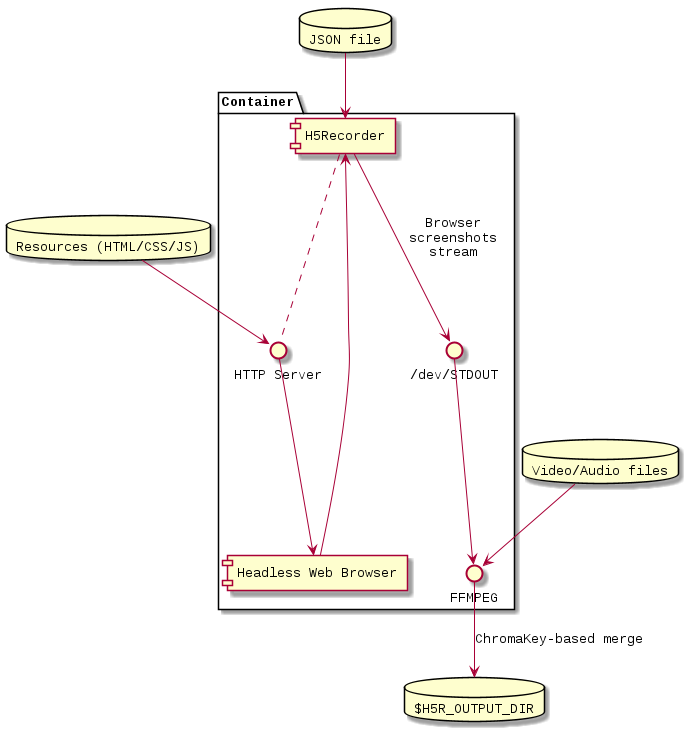
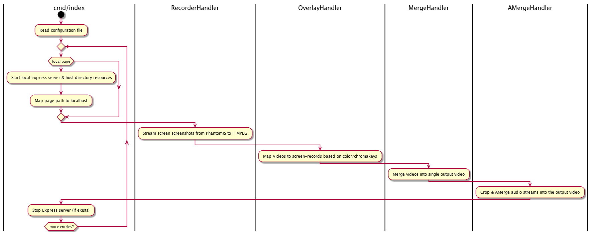

# Overview
Headless page video recorder, you simply provide array of paths ,relative to the current working directory or a valid webpage URL and provide their starting and ending URI hash and get a video for each entry. Cropping, scaling, color-based overlaying values are optionals


>watch sample output in portrait on mobile's fullscreen mode on [youtube](https://youtu.be/w_RTerk7wtY)

# Run via Docker/Compose

[](doc/docker.puml)

```bash
docker run \
    # Inject the JSON Config file (sample.json) into the container
	-v $(pwd)/sample.json:/usr/app/sample.json \
    # Map the output directory into a local volume
	-v $(pwd)/output:/usr/app/output \
    # Internet access might be required to load some webpages (HTTP/HTTPS urls)
	--network host \
    # my docker image, obviously
	yoga1290/h5recorder:0.0.48 \
    # a config file path to use, relative to the container's working directory (/usr/app/):
	sample.json
```

+ **Docker Compose**: See [docker-compose.yml](docker-compose.yml) sample.

# Install

+ NodeJS & NPM installed
+ `npm i -g h5recorder` for commandline tool, or `npm i [-P|-D] h5recorder` inside a node project

# Run

+ First, you'll need to provide a JSON configuration in the following format: `[{page, startHash, endHash, size{w, h}}]` [[JSON Schema](schema.json)]
  + other supported configuration:

```javascript
[{
  // a free port will be determined on runtime
	"page": "sub-directory/file.html",
	"startHash": "0",
	"endHash": "end",
	"size": {
		"w": 400,
		"h": 710
	},
	"overlay": [{ //optional
		"video": "overlay.mp4",
		"colorkey": "black", //default: green
		"similarity": 0.7, //optional
		"time": { //optional
			"start": 0,
			"end": 8
		},
		"crop": {
			"aspectRatio": 0.5625,
			"offset": { // optional
				"x": 0.3, // [0-1]
				"y": 0 // [0-1]
			}
		}
	}],
	"audio": [{ //optional; array
		"path": "PathToAudio/VideoFile",
		"start": 0, // time in sec
		"end": 10, // time in sec
		"volume": 0.5 // [0 - 1.0]
	}, { //optional; array
		"path": "PathToAudio/VideoFile2",
		"start": 10, // time in sec
		"end": 15, // time in sec
		"volume": 0.5 // [0 - 1.0]
	}]
}]
```

+ you can pass the configuration as a `$CONFIG_FILE` file to the commandline tool, after installing the package with the global `-g` flag; `h5recorder $CONFIG_FILE`

+ or, you can execute it inside another node module:

```javascript
const h5recorder = require('h5recorder')
h5recorder([{
	"page": "sub-directory/file.html",
	"startHash": "0",
	"endHash": "end",
	"size": {
		"w": 400,
		"h": 710
}]).then((outputVideoFile) => {})
```

+ that's all, you'll get a single file after merging all entries.

# Flow:
[](doc/readme.puml)

# Inspiration
+ this was inspired by [phanan's snippet](https://gist.github.com/phanan/e03f75082e6eb114a35c#file-runner-js), modified & wrapped to be more flexible; just meets my needs :P

# :bell: Changelog

### 0.0.47

+ [Docker Image (& Docker Compose)](https://github.com/yoga1290/H5Recorder/issues/4)

### 0.0.30 - 0.0.43

+ AMerge, adjust volume, merge multiple audio streams and merge it with the final output file
+ JSON Schema validation fixed
+ 10 sec time limit for page recording step if no `endHash` redirect.
+ Local express server will run only for relative local page.
+ JSDoc & gitlab-ci

### 0.0.30

+ [fix ajv, validation schema & local phantom module path](https://github.com/yoga1290/H5Recorder/pull/2)
