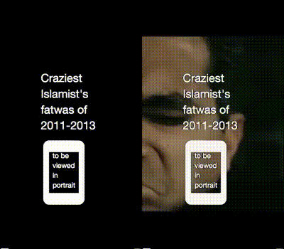

# Overview
Headless page video recorder, you simply provide array of paths ,relative to `www` directory or a URL to a server webpage, to the desired pages and their starting and ending URI hash and get a video for each entry. Cropping, scaling, color-based overlaying values are optionals


>watch sample output in portrait on mobile's fullscreen mode on [youtube](https://youtu.be/w_RTerk7wtY)

# Install

+ Unix-like OS or bash-supported console
+ FFMPEG, You will need FFMPEG either installed globally or located in the same project directory.
+ NodeJS & NPM installed
+ run `npm i` in project directory from terminal.

# Run

+ First, you'll need to provide a JSON file in the following format: `[{page, startHash, endHash, size{w, h}}]`; check [sample.json](https://github.com/yoga1290/H5Recorder/blob/master/sample.json)
  + other options:

```javascript
[{
  // a free port will be determined on runtime
	"page": "http://localhost/new30.html",
	"startHash": "0",
	"endHash": "end",
	"size": {
		"w": 400,
		"h": 710
	},
	"overlay": [{ //optional
		"video": "overlay.mp4",
		"colorkey": "black", //default: green
		"similarity": 0.7, //optional
		"time": { //optional
			"start": 0,
			"end": 8
		},
		"crop": {
			"aspectRatio": 0.5625,
			"offset": { // optional
				"x": 0.3, // [0-1]
				"y": 0 // [0-1]
			}
		}
	}]
}]
```

+ run `npm start [data.json]`, where `data.json` is the provided input file.

+ that's all, you'll get `v0.mp4, v1.mp4,...` files in the project directory depending on the number of entries provided in the JSON file.

# Credit
+ this was inspired by [phanan's snippet](https://gist.github.com/phanan/e03f75082e6eb114a35c#file-runner-js), modified & wrapped to be more flexible; just meets my needs :P
